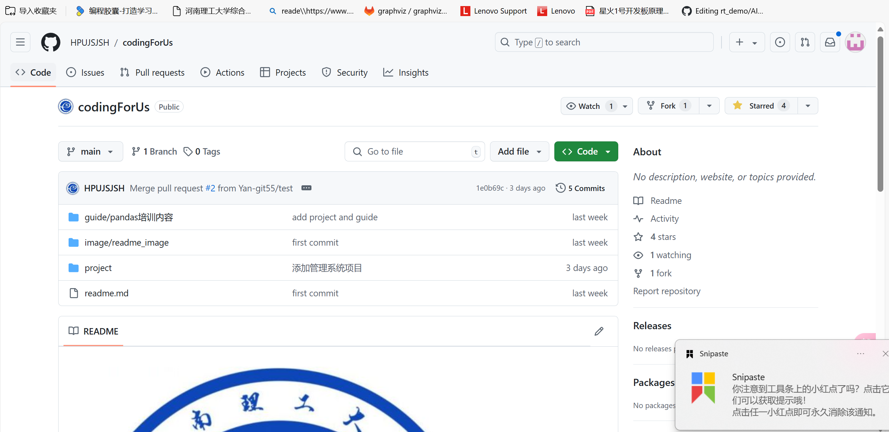
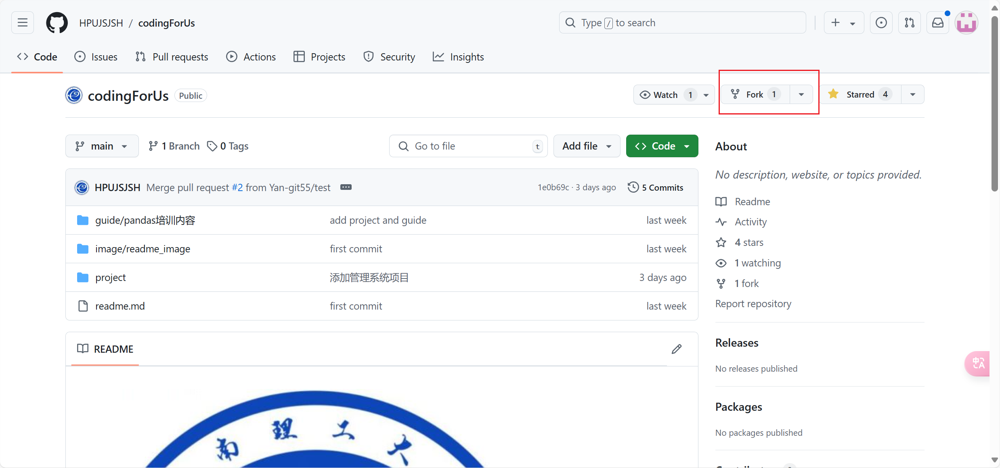
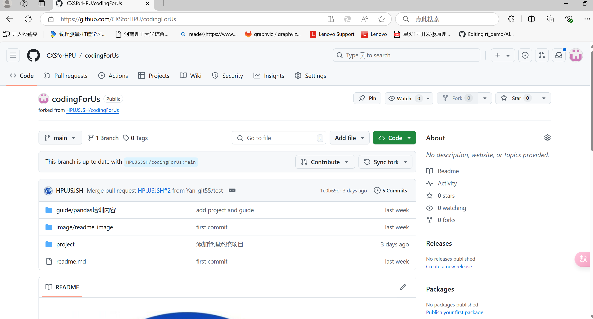
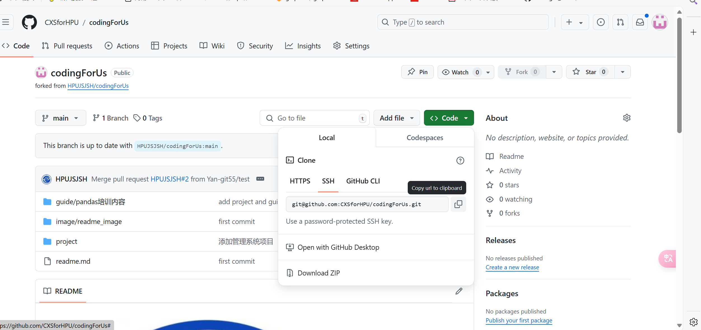
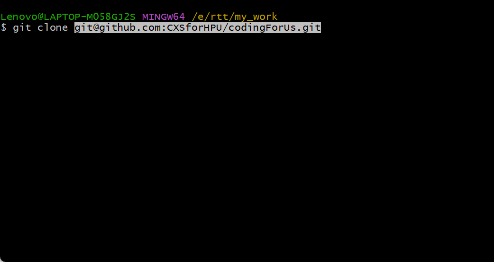
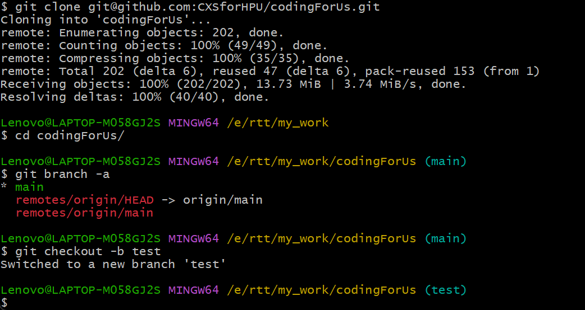
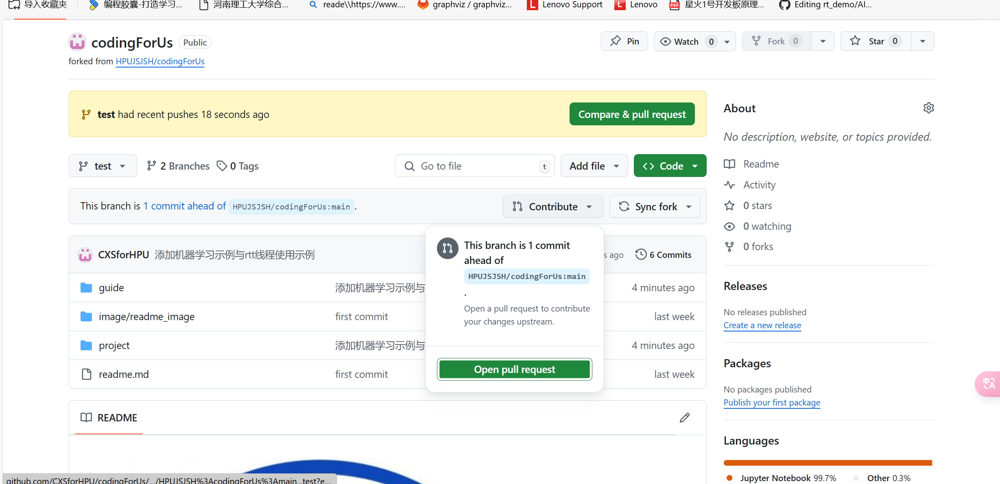
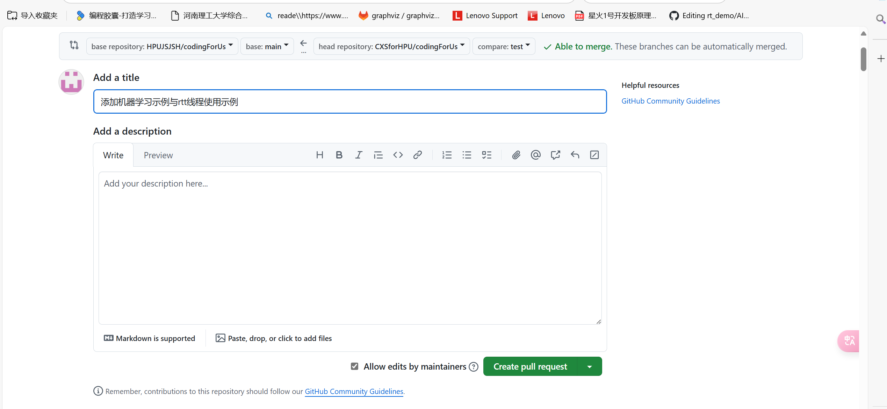

# PR提交流程


[TOC]

# 找到官方代码仓库

* 例如我们先找到协会官方代码仓库 [HPUJSJSH/codingForUs (github.com)](https://github.com/HPUJSJSH/codingForUs)	




# 对官方仓库进行FORK




* 该步骤将官方仓库克隆到自己账号上进行编写

## 此时自己账号上便存有官方仓库的FROK

*** 要注意的是，在提交PR之前要进行对官方仓库的同步，用来尽量避免提交冲突***



# 将自己仓库克隆到本地

## 首先配置ssh密匙

*** 参考以下文章***

[Github配置ssh key的步骤（大白话+包含原理解释）_github生成ssh key-CSDN博客](https://blog.csdn.net/weixin_42310154/article/details/118340458)


## clone 本地仓库



* 选择复制ssh链接

```c
git clone <ssh>
```



## 切出一个新的本地仓库分支

```c
git checkout -b test
```



# 在本地仓库进行修改，以及提交

## ***对于上传文件项目过大，建议存在网盘，分享网盘链接***

```c
//添加暂存区
git add .
    
// 提交本地仓库
git commit -m "添加备注"
    
// 提交到云端
git push origin test<仓库分支名称>
    
```

# 在自己的远程仓库提出PR合并请求






# 附录

## git常用命令

```c
git fetch 	//本地的远程与远程同步
git pull 	// 本地的本地分支与远程同步

git checkout -b 'new_branch_name'	//创建新分支
git switch 'branch_name'			//切换指定分支

git log 	//查看git日志

git add xxx
git commit -m "xxx"
git push -u origin 'new_branch_name':main

git branch <new-branch-name> <commit-hash>	// 切换到指定提交历史

git status	//查看本地分支文件变更情况

# 弃用本地所有变更文件
git clean -nxdf（查看要删除的文件及目录，确认无误后再使用下面的命令进行删除）
git checkout . && git clean -xdf

# 将本地分支推送到origin分支并建立关联关系，后续可使用git push直接推送
git push --set-upstream origin 'new-branch'

# 切换远程仓库地址
git remote rm origin
git remote add origin https://github.com/kurisaW/rt-thread.git

# 初始化本地仓库为版本库，注意不要自己在远端仓库建立此仓库
git init
git add .
git commit -m "First commit"
git remote add origin URL
git push -u origin master

# github仓库回退到某个commit
git reset --hard "commit_hash"
git push origin HEAD --force

# 将一个PR中的多个提交历史合并为一条commit
git rebase -i origin/master		# 这里的master为你需要提交的目标分支
							  # 接下来会打开一个文本编辑器，如pick [hash] commit1...之类
git rebase -i HEAD~2			# 压缩本地的两个提交
pick abc123 提交1				 # 除了最上面的pick保留，其他的pick需要修改为'squash'或's',表示将该提交合并到前一个提交
squash def456 提交2
squash hij789 提交3
git push origin HEAD:<name-of-remote-branch>

# 变基到main分支
git rebase main
git push origin 'origin_branch' -f

# 从本地的一个分支提交到任意一远端分支
git push origin 'local_branch':'remote_branch' -f

# 设置本地的远程分支
git remote set-url origin https://github.com/kurisaW/rt-thread.git

# 推送远程任意仓库分支
git push origin branch
git push origin master:master	# 前一个master为本地分支，后一个为远程分支名

# 删除本地分支
git branch -d 'branch_name'

# 删除本地除master分支之外所有的本地分支
git branch | grep -v "master" | xargs git branch -D

# 撤销commit
git reset --soft HEAD^
git reset --soft HEAD^2		# 撤销两个commit

# git针对某一Hash提交进行打补丁操作
git format-patch -1 Hash-VAL		(仅对当前这一Hash-VAL进行打补丁)
# git应用补丁文件
git apply --check path/to/xxx.patch (验证补丁文件是否可行)
git apply path/to/xxx.patch		    (打补丁操作)
```

