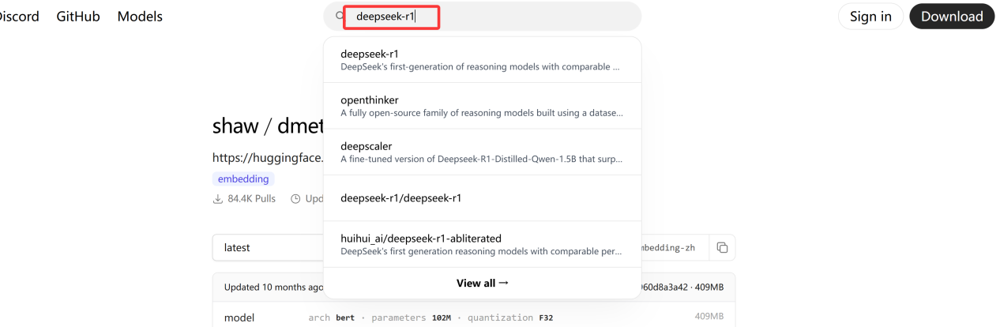

# Deepseek本地部署及连接知识库

## 准备工作

- 关闭防火墙

示例步骤：

Windows系统

1. Win+R打开控制面板并输入“control”

2.单击“系统和安全”

3.单击“Windows Defender防火墙”

4.单击 “启用或关闭Windows Defender防火墙”

5.在 “专用网络设置和公用网络设置”里，都关闭 Windows Defender防火墙

6.单击“确定”

## 一、下载Ollama

进入https://ollama.com

选择合适的系统版本下载

点击“Download for XXX”进行下载并安装

下载安装完成后，Win+r 打开终端

在终端输入ollama help 如果出现下面这些表明下载完成

## 二、下载deepseek-R1模型

进入https://ollama.com

1.搜索deepseek-r1

2.根据自己电脑配置选择不同模型

如何查看自己电脑的配置？

2.1windows设置查看：

　　1、点击设置

　　从Windows电脑桌面左下角找到并点击“ 开始 ”，出现弹窗后点击“ 设置 ”。

　　2、点击系统

　　弹出windows设置窗口后，点击页面中的“系统”进入。

　　3、点击关于

　　从页面左侧的功能栏里找到并点击“关于”，右边页面将会出现设备规格即可查看电脑配置。

　　快捷键查看

　　1、按住win和R

　　[键盘](https://product.pconline.com.cn/keyboard/)上同时按住win和R键，页面将会出现一个小弹窗。

　　2、点击确定

　　从小弹窗里输入“dxdiag”,并点击确定选项，进入一个新的页面。

　　3、查看配置

　　待弹出页面后，系统信息下便是电脑配置，可自行查看。

　　2.2mac查看

　　1、点击关于本机

　　点击桌面左上角的苹果图标，再点击关于本机进入。

　　2、选择配置信息

　　出现弹窗后在上方功能栏，选择想查看的电脑配置信息。

　　3、查看配置

　　如果想查看更加详细的信息，点击“ 系统报告 ”，电脑配置详情便出现，即可自行查看。

选择显存满足魔性要求的版本下载

选择好模型复制指令（以32b为例）

3.在终端输入此指令进行下载deepseek模型

自动安装模型

安装成功(输入命令演示)

4.如果下次再从终端打开运行模型输入以下命令：
==ollama run deepseek-r1:**b==，**为自己下载的模型名称

## 三、下载Cherry Studio（用来美化界面以及连接知识库等作用）

进入https://cherry-ai.com下载客户端

下载软件并安装

## 四．下载词嵌入模型

进入https://ollama.com还是ollama官网

搜索shaw/dmeta-embedding-zh

复制指令

在终端输入指令下载

## 五．在Cherry Studio中选用本地模型进行对话

打开安装好的Cherry Studio按步骤操作

点击添加

选择本地部署的模型就可进行对话

## 六．在Cherry Studio中连接知识库

进入知识库添加页面并点击添加

知识库名称自己命名，嵌入模型选用刚才下载的词嵌入模型
可以添加文件到知识库

添加知识库后，在对话时就可选择知识库，让大模型根据提供知识库回答

## 视频教程

B站视频链接：https://b23.tv/OF0eUEp