# 简介
  Github提供学生认证，成功后可以免费领取Copilot Pro，免费使用Jetbrains的IDE等特权，对于开发帮助很大。其中Copilot Pro配合vscode使用效果很好，在Github也能直接利用Copilot帮忙分析仓库，使用方便。
# 参考资料
- [Github学生认证及学生包保姆级申请指南 - 知乎](https://zhuanlan.zhihu.com/p/578964972)
- [Github的学生认证免费领coplit pro - 知乎](https://zhuanlan.zhihu.com/p/29735660108)
# 教程
## 1. 激活教育邮箱
首先需要激活自己的教育邮箱
在 https://mail.hpu.edu.cn/ 中，选择 **学生登录** - **邮箱注册**
邮箱账户为： 你的学号@home.hpu.edu.cn
注册后即可访问自己的教育邮箱，之后将用于作为Github学生认证的验证接收
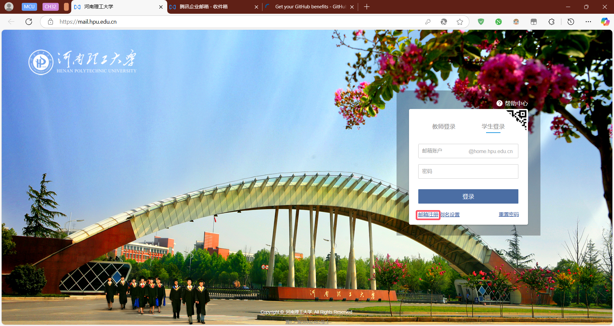
- 同时建议将教育邮箱添加到企业微信，方便查收
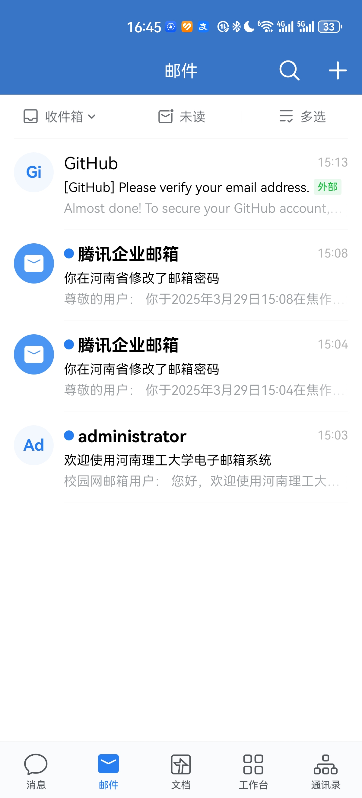
## 2. 获取学籍证明
登录学信网[学信档案](https://my.chsi.com.cn/archive/index.action)，选择 **在线验证报告** ，查看 **教育部学籍在线验证报告**
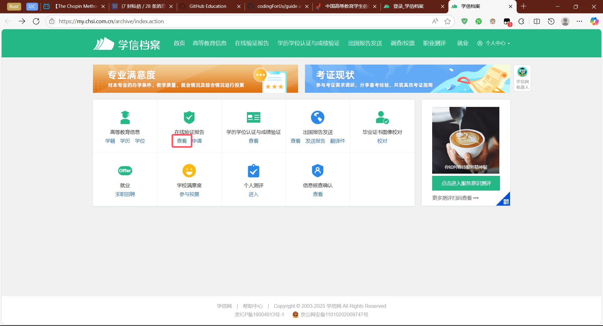
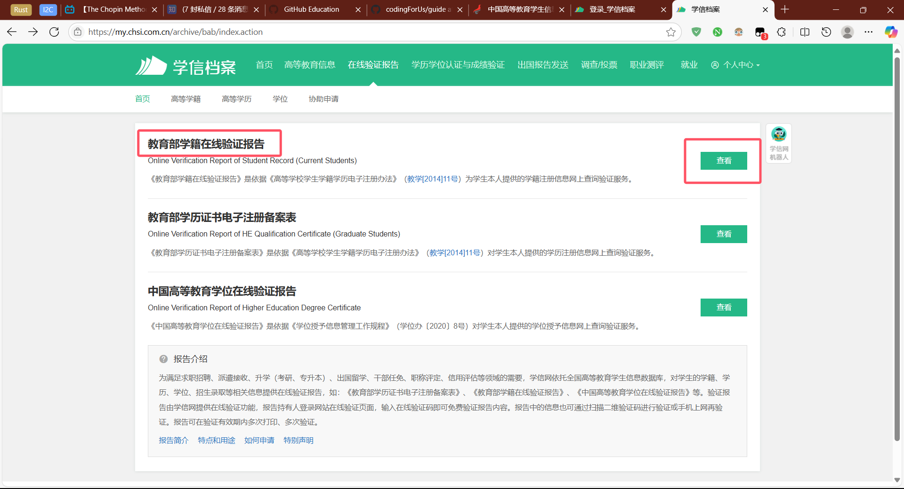
一般来说大家在入学时都使用过验证报告，所以点击 **延长认证有效期** 即可重新获取自己的学籍证明，下载PDF文件后，使用PDF编辑，或PDF翻译工具将学籍证明**翻译成英文版**（能大大提高通过率），并导出为**最小分辨率1024x768**，**最大大小1MB**的**PNG或JPEG**图片用于上传到Github。如果有水印也无需担心
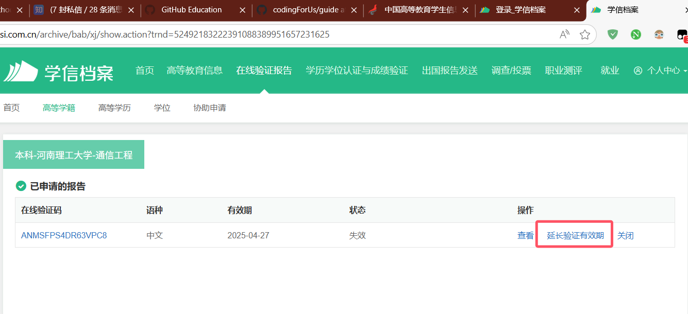
## 3. 绑定教育邮箱
首先建议先在Github上绑定自己的教育邮箱，因为之后还需要验证邮箱
[Email settings](https://github.com/settings/emails)
## 4. 填写认证信息
1. 在 [Get your GitHub benefits - GitHub Education](https://education.github.com/discount_requests/application) 中选择学校，然后点击下一步
	- 如果邮箱已经验证过了，这里可以直接选择学校；如果没有，则还需要填写学校名称和邮箱
	- 如果电脑点击下一步没反应，可以参考这个教程：[Github学生认证第一步点击continue没反应的解决方案 - 知乎](https://zhuanlan.zhihu.com/p/643398611)，或用手机进行验证
	- 注意不要使用魔法，认证过程需要定位，判断你是否在学校内
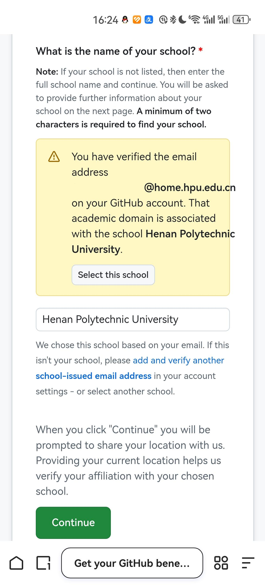
2. 根据提示填写信息，到了要求上传学籍证明时，选择之前导出的学籍证明图片上传即可
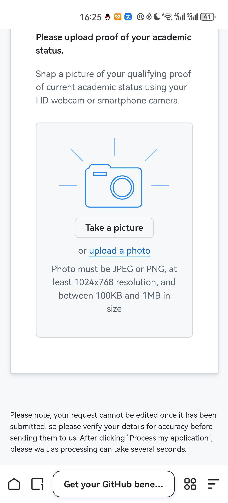
3. 成功后，会进入审核阶段，等待几天即可。如果提供的是英文版的学籍证明，大概率是可以一次性通过的，可以在申请界面查看申请情况，一般通过会很快。
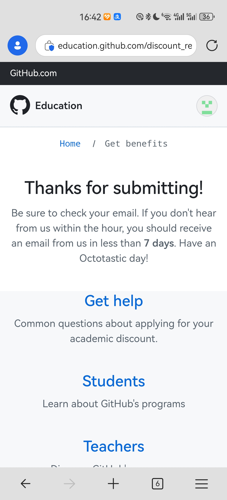
4. 成功获得学生资格后，邮箱会收到成功通知，此时就可以开始领取学生特权了。
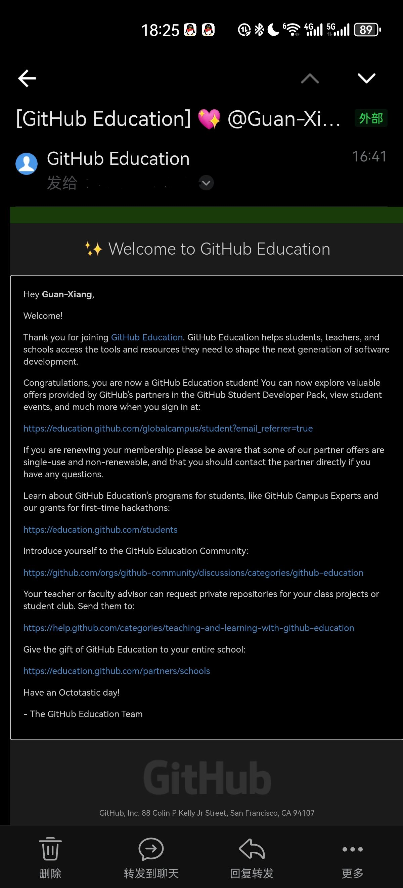
# 领取学生特权
学生权益需要手动领取，如Jetbrains的IDE需要使用有学生特权的Github账号登录，之后就可以获取。以可能常用的Copilot为例，进入[github.com/github-copilot/signup](https://github.com/github-copilot/signup)，点击领取即可获得Copilot Pro，之后即可无限制使用Copilot，并解锁多种模型。
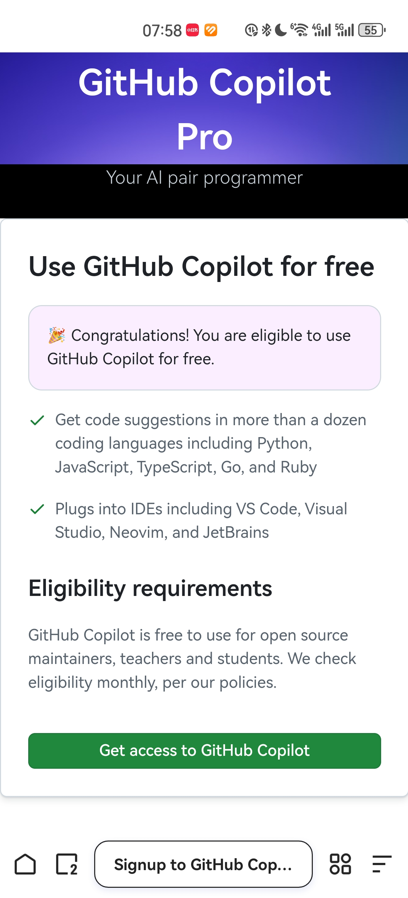
- 还有很多特权可领取，详情见[GitHub Education](https://education.github.com/learner/learn)
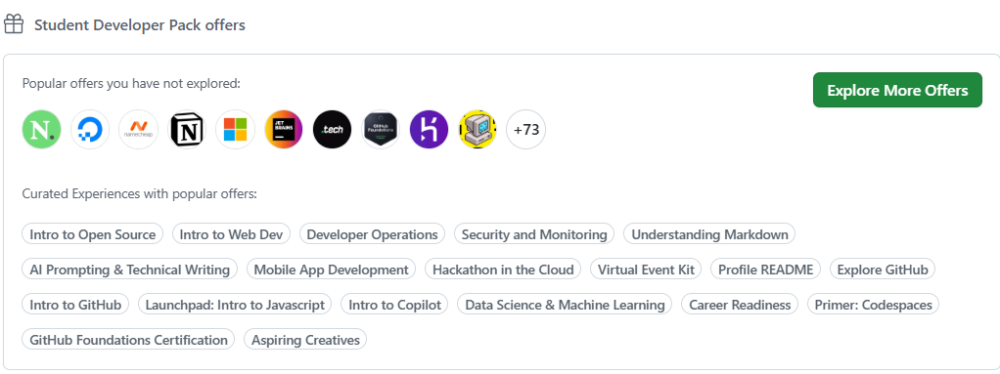