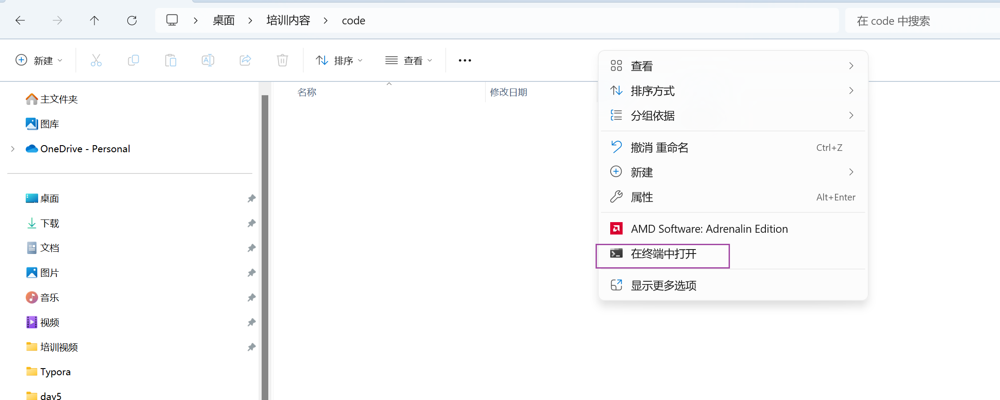
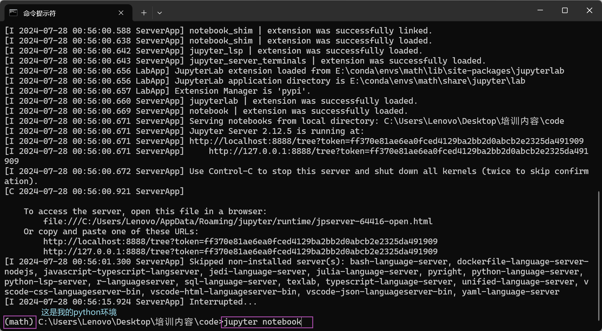
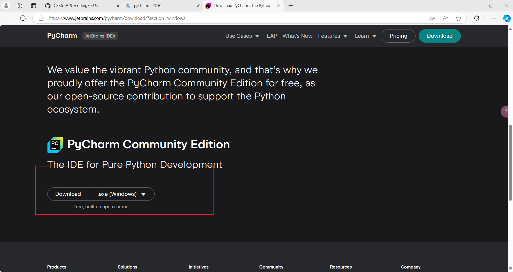
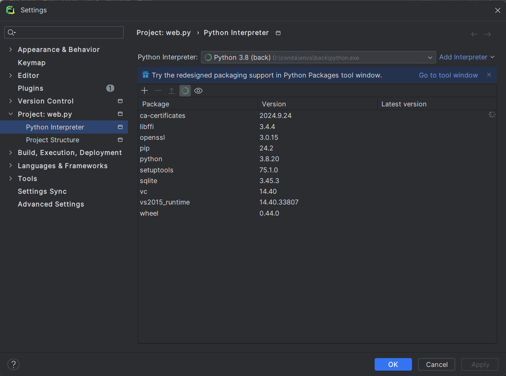

# conda 环境安装

* conda 官网

##  什么是conda

* Conda是在Windows、macOS和Linux上运行的开源软件包管理系统和环境管理系统。**Conda可以快速安装、运行和更新软件包及其依赖项**。Conda可以轻松地在本地计算机上的环境中创建，保存，加载和切换。它是为Python程序创建的，但可以打包和分发适用于任何语言的软件。
* Conda允许您在**多个通用环境**之间进行切换和管理，在**多个通用环境中**，其他多个版本的版本号可能会有所不同，例如C库，编译器，测试套件或数据库引擎等。


## 平台的安装方式

* 在此我们以x86 64 位的windows系统电脑安装方式进行讲解
* 考虑到一些同学没有VPN的方式，我们采用国内镜像进行安装
  * https://mirrors.tuna.tsinghua.edu.cn/

## windows平台


### 名称格式介绍

* 名称	Anaconda3-5.3.1-windows-x86_64.exe
  * Anaconda ***软件名字***
  * 5.3.1 ***版本号***
  * windows-x86_64 ***适合的操作系统以及电脑架构***


### 安装流程

#### 

.


* 此操作会将其加载到系统变量路径上面
  * 使其能够直接在命令行中访问到

## 打开方式

* win+r 启动命令行

## 基础使用指令

### 

### 创建环境

```pytho
conda create -n <name> python=<version>
```


### 展示所有环境

```python
conda env list
```

### 启动环境

```python
conda activate <name>
```

### 删除环境

```python
conda remove -n <name> --all
```

### 安装包

```python
conda install pkgs
```

### 删除包

```python
conda uninstall pkgs
```

# jupyter


## 介绍

Jupyter Notebook是一个开源的Web应用程序，允许用户创建和共享包含代码、方程式、可视化和文本的文档。它的用途包括：数据清理和转换、数值模拟、统计建模、数据可视化、机器学习等等。它具有以下优势：

可选择语言：支持超过40种编程语言，包括Python、R、Julia、Scala等。
 分享笔记本：可以使用电子邮件、Dropbox、GitHub和Jupyter Notebook Viewer与他人共享。
 交互式输出：代码可以生成丰富的交互式输出，包括HTML、图像、视频、LaTeX等等。
 大数据整合：通过Python、R、Scala编程语言使用Apache Spark等大数据框架工具。支持使用pandas、scikit-learn、ggplot2、TensorFlow来探索同一份数据。

## 安装

```python
#conda 安装
conda install jupyter
#pip 安装

python -m pip install jupyter -i https://pypi.tuna.tsinghua.edu.cn/simple

```


## 基本使用

### 如何启动



```python
#在安装过jupyter的python环境中输入jupyter
jupyter notebook
```



### 创建文件


* 生成一个notebook文件

### 更换文件名称


### 常用快捷键使用

#### 命令模式 (按键 Esc 开启)

- **Enter** : 转入编辑模式
- **Y** : 单元转入代码状态
- **M** :单元转入markdown状态
- **R** : 单元转入raw状态

#### 编辑模式 ( Enter 键启动)

- **Tab** : 代码补全或缩进

- **Ctrl-A** : 全选

- **Ctrl-Z** : 复原

- **Esc** : 进入命令模式

- **Ctrl-Enter** : 运行本单元

# pycharm 环境配置

## 软件下载

### 网址

* [Download PyCharm: The Python IDE for data science and web development by JetBrains](https://www.jetbrains.com/pycharm/download/?section=windows)



## 解释器配置




* Add Interpreter -> Add local Interpreter -> Existing

* 选择conda 中env中需要使用的python.exe文件

* 点击 Apply 按钮 再点击 Ok
