# 1.1.1 操作系统的概念、功能和目标（系统资源的管理者、提供接口、作为扩充机器、虚拟机）

## **1.熟悉的操作系统举例**

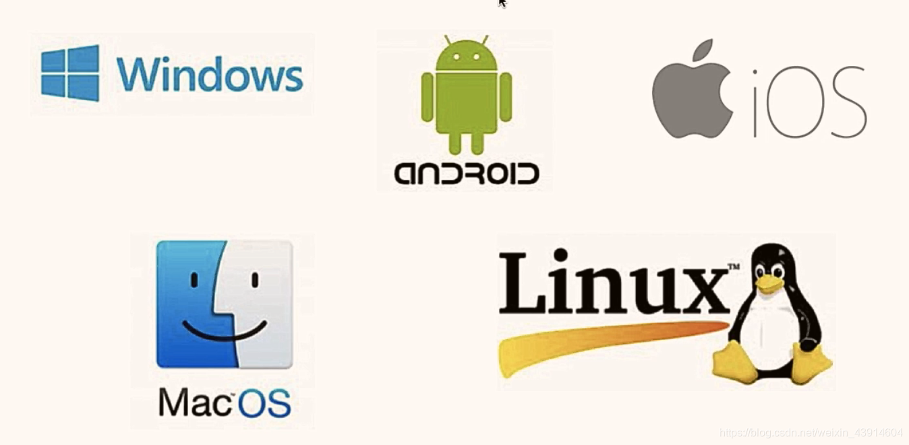

## **2.操作系统的层次结构**

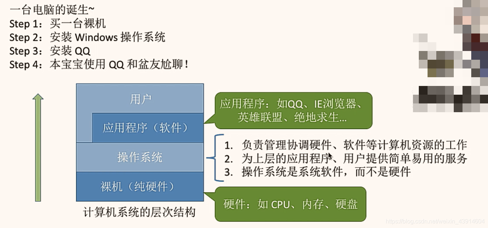

## **3.操作系统的概念**

- 是系统最基本最核心的软件，属于系统软件

- 控制和管理整个计算机的硬件和软件资源

- 合理的组织、调度计算机的工作与资源的分配

- 为用户和其它软件提供方便的接口和环境

  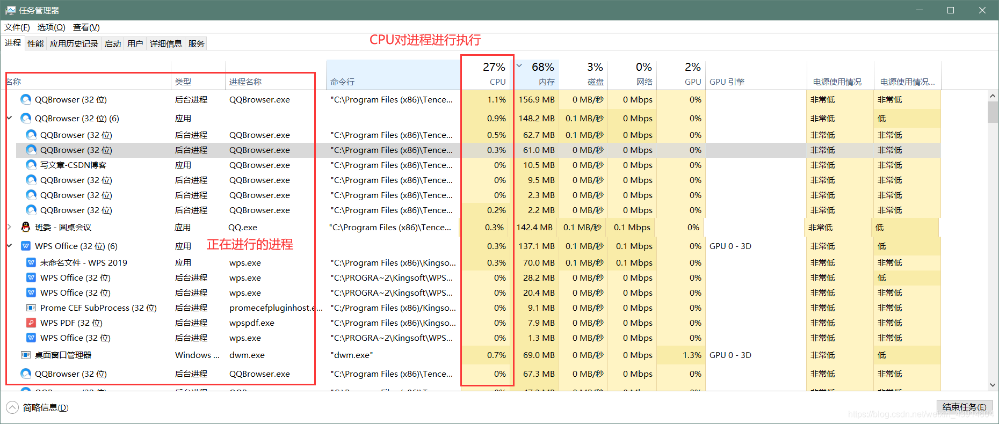

## **4.操作系统的功能和目标**

- 先放一张思维导图，大致知道操作系统的具体功能和目标，然后再一一展开叙述。

  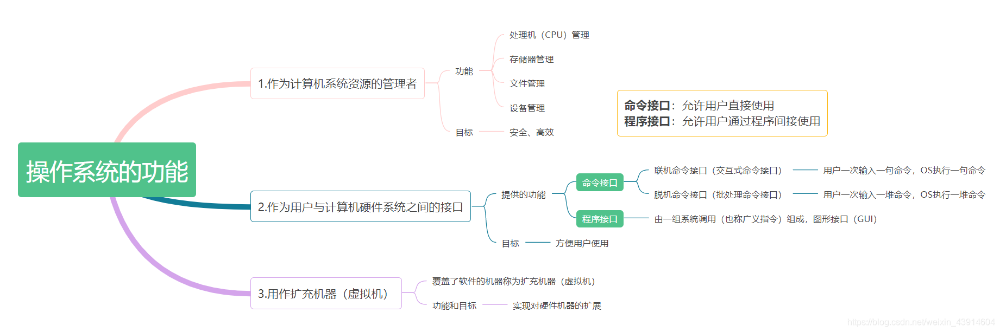

- 用一个直观的例子来理解上述图中操作系统的功能：

  > - 我们假设：用户是雇主，操作系统是工人（用来操作机器），计算机是机器（由处理机(CPU)、存储器、设备、文件几个部件构成）
  > - 工人有熟练的技能去控制和协调各个部件的工作，这就是`操作系统对资源的管理`
  > - 同时，工人必须接受雇主的命令，这就是`“接口”`
  > - 有了工人，机器就能发挥更大的作用，因此工人就成了`“扩充机器”`
  > - 工人操作机器、机器有了更大的作用比如GUI界面，于是工人便成了`扩充机器`，去扩充GUI界面等功能

### （1）作为计算机系统资源的管理者

- 管理软硬件资源、合理的组织、调度计算机的工作与资源的分配

  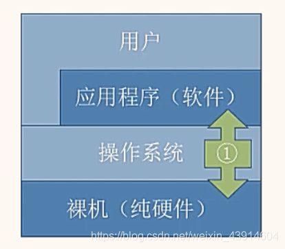

#### ① 处理器（CPU）管理

- 在多道程序环境下，cpu的分配和运行都以进程（或线程）为基本单位，因此对cpu的管理可理解为对进程的管理。进程管理的主要功能包括`进程控制、进程同步、进程通信、死锁处理、处理机调度`等。附上一张图理解对进程的管理。

  

#### ② 存储器管理

- 为多道程序的运行提供良好的环境，方便用户使用及提高内存的利用率，主要包括`内存分配与回收、地址映射、内存保护与共享和内存扩充`等功能。

  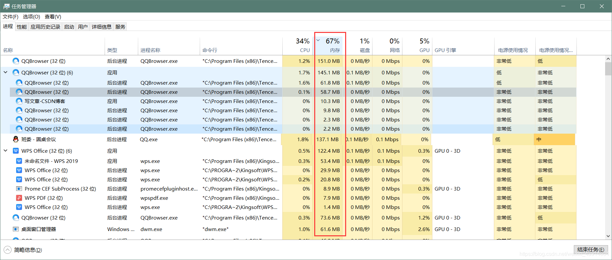

#### ③ 文件管理

- 计算机中所有的信息都是以文件的形式存在的，操作系统中负责文件的管理的部分称为文件系统，文件管理包括`文件存储空间的管理、目录管理及文件读写管理和保护`等

  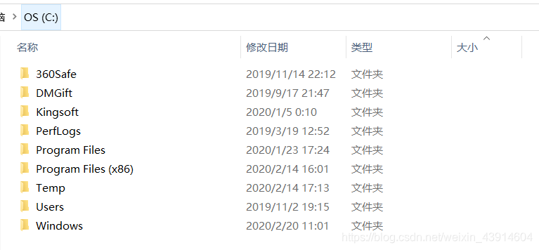

#### ④ 设备管理

- 设备管理的主要任务是完成用户的I/O请求，方便用户使用各种设备，并提高设备的利用率，主要`包括缓存管理、设备分配、设备处理和虚拟设备`等功能

  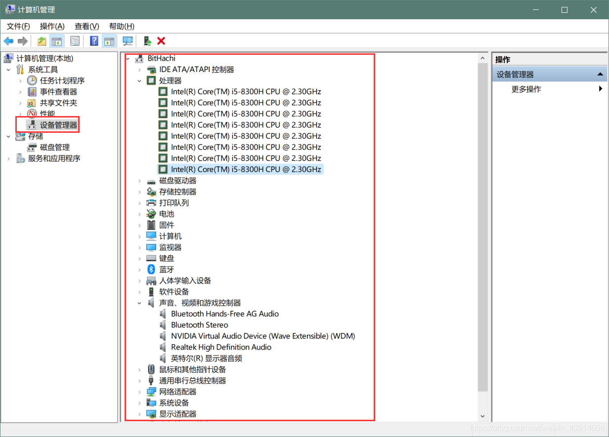

- 以上4种管理功能都由“工人”负责，“雇主”无序关注。

### （2）作为用户与计算机硬件系统之间的接口

- 为了让用户方便、快捷、可靠的操作计算机硬件并执行自己的程序，操作系统提供了用户接口

- 操作系统提供的接口分为两类：`命令接口和程序接口`

- `命令接口`：用户可以`直接`使用的，利用这些操作命令来组织和控制作业的执行

- `程序接口`：用户通过程序`间接`使用的，编程人员可以使用它们来请求操作系统服务

  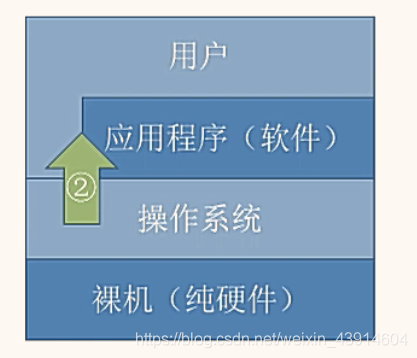

  

#### ① 命令接口

- 命令接口分为两类：联机命令接口和脱机命令接口，用户可以`直接`调用

- `联机命令接口`：又称交互式命令接口，适用于分时或实时系统的接口，由一组键盘操作命令组成。用户输入一条指令，操作系统就执行一条指令

  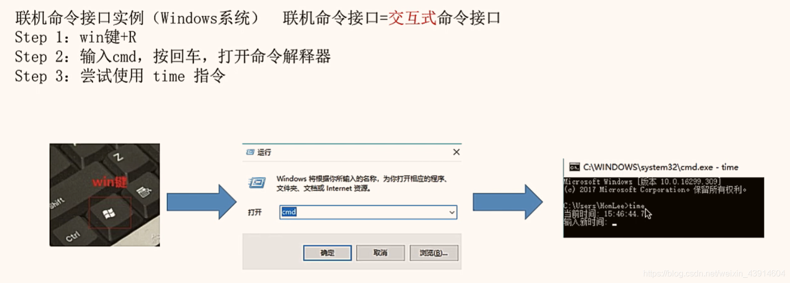

- `脱机命令接口`：又称批处理接口，使用于批处理系统，由一组作业控制命令组成。用户输入一堆指令，操作系统运行一堆指令。在操作系统运行这些命令时用户不可干预。

  > 批处理(Batch)，也称为批处理脚本。顾名思义，批处理就是对某对象进行批量的处理，通常被认为是一种简化的脚本语言，它应用于DOS和Windows系统中。批处理文件的扩展名为bat 。
  >
  > 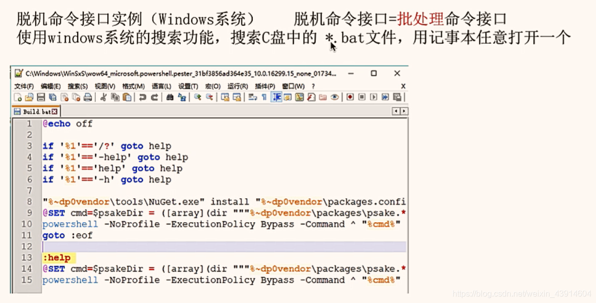

#### ② 程序接口

- 程序接口：由一组`系统调用（也称广义指令）`组成

- 用户通过在程序中使用这些系统调用来请求操作系统为其提供服务，只能通过用户程序`间接`调用

- 如使用各种外部设备、申请分配和回收内存及其它各种要求

  

  

  > 动态链接库英文为DLL，是Dynamic Link Library的缩写。DLL是一个包含可由多个程序，同时使用的代码和数据的库。

- 比如常见的图形用户界面程序接口GUI

  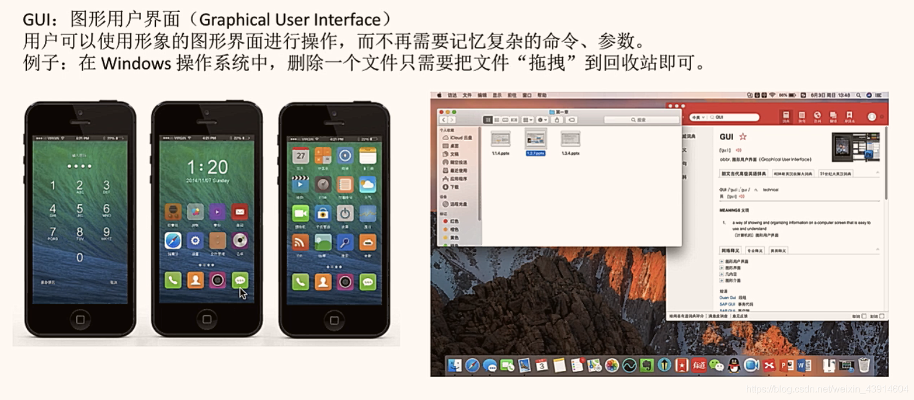

### （3）作为扩充机器（虚拟机)

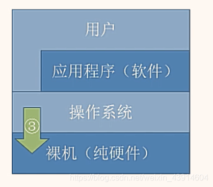

- 没有任何软件支持的计算机称为`裸机`

- 覆盖了软件的机器称为`扩充机器或虚拟机`

  

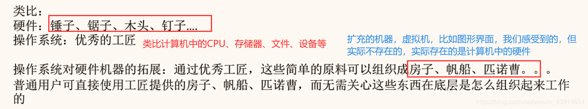