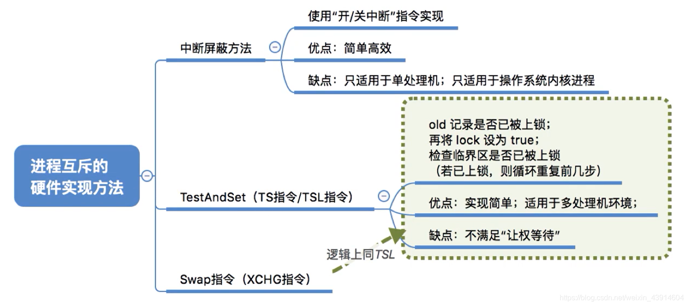
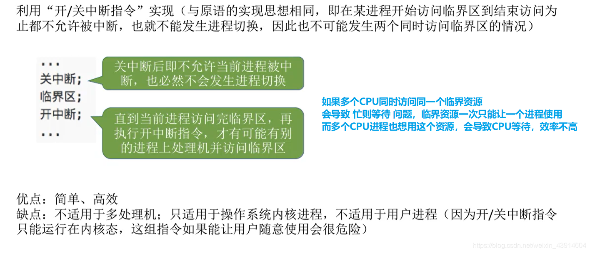
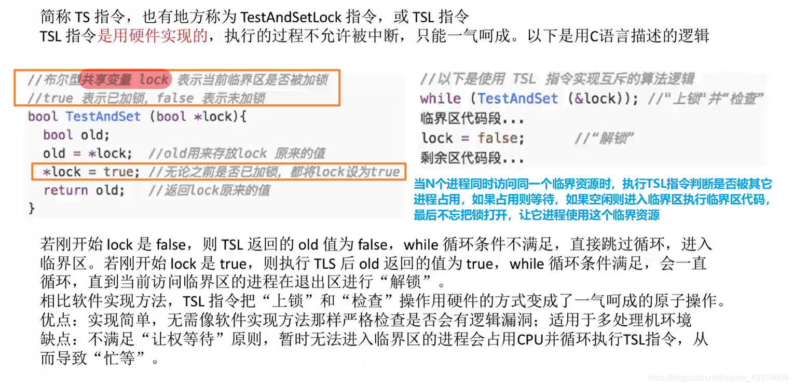
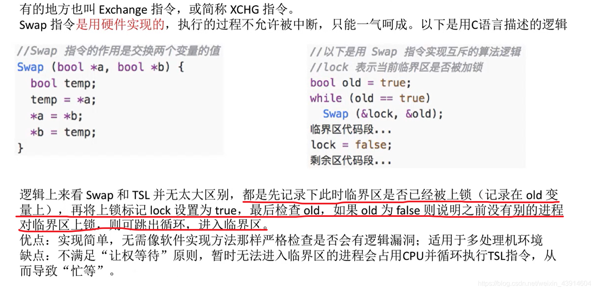

# 2.3 实现临界区进程互斥的硬件实现方法

#### 0.思维导图

#### 1.中断隐藏方法

#### 2.TestAndSet指令

- 执行TSL指令时，它的内部运转逻辑

- 假设lock现在为false，代表临界资源A空闲，那么我就可以访问这个资源，同时将lock=true，提醒别的进程，这个临界资源A我正在使用，让他们等等

- 假设lock为true，代表临界资源正在有人使用，所以我必须等待，并且将lock=true，并不影响什么，所以没关系，只是为了让lock为false时可以上锁，将上锁与检查在一个SL指令完成。

  

#### 3.[Swap](https://so.csdn.net/so/search?q=Swap&spm=1001.2101.3001.7020)指令

- old是每个进程都要进行的一步，都必须将old=true
- 分析一下这样做的原因：

- 因为lock是某一特定临界资源的共享变量，当每一个进程准备访问这个特定的临界资源时，初始化old=true，然后进入while循环进行交换，如果当前lock是false,则交换后old=false,则当前进程可以跳出循环进入临界区代码段，同时因为交换，lock=old=true上锁，不让别的进程来打扰，别的进程会因为lock变为true,一直在while循环等待,当我使用完临界资源，则将lock=false,此时别的进程再交换old和lock就能判断old=false,可以跳出循环，使用临界资源。

