# 2.3.4 操作系统之信号量机制（整型信号量、记录型信号量P、V）

#### 0.思维导图

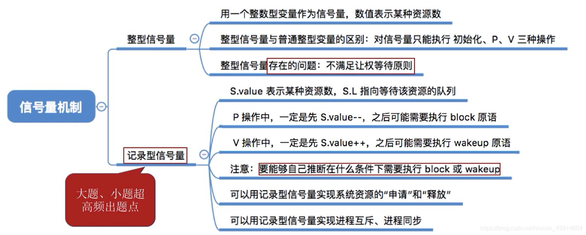

#### 1.为什么引入[信号量](https://so.csdn.net/so/search?q=信号量&spm=1001.2101.3001.7020)机制？

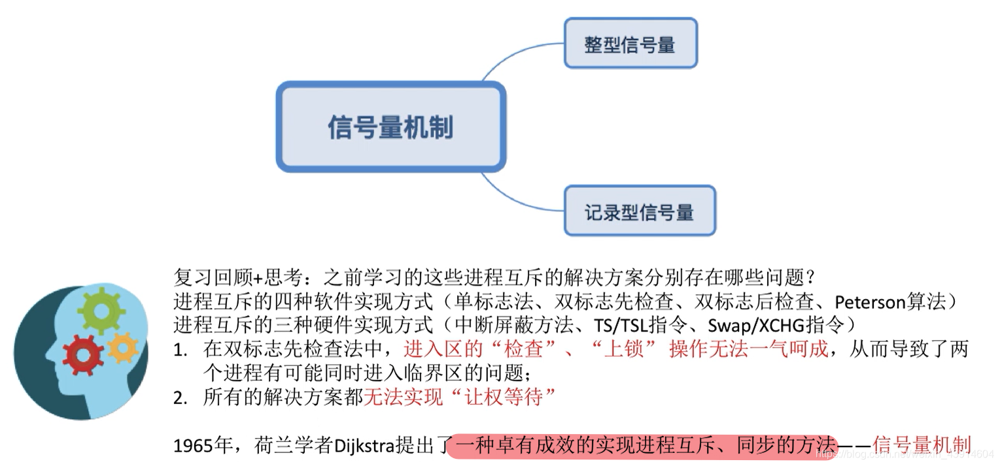

#### 2.什么是信号量机制？

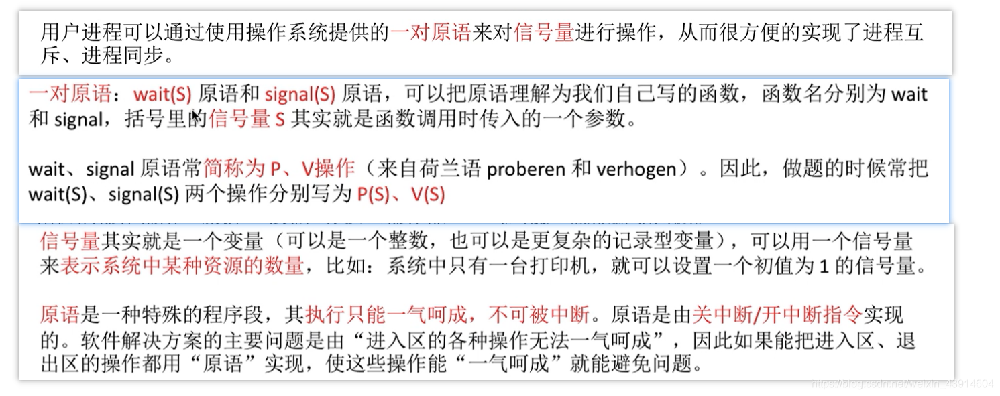

#### 3.[整型](https://so.csdn.net/so/search?q=整型&spm=1001.2101.3001.7020)信号量

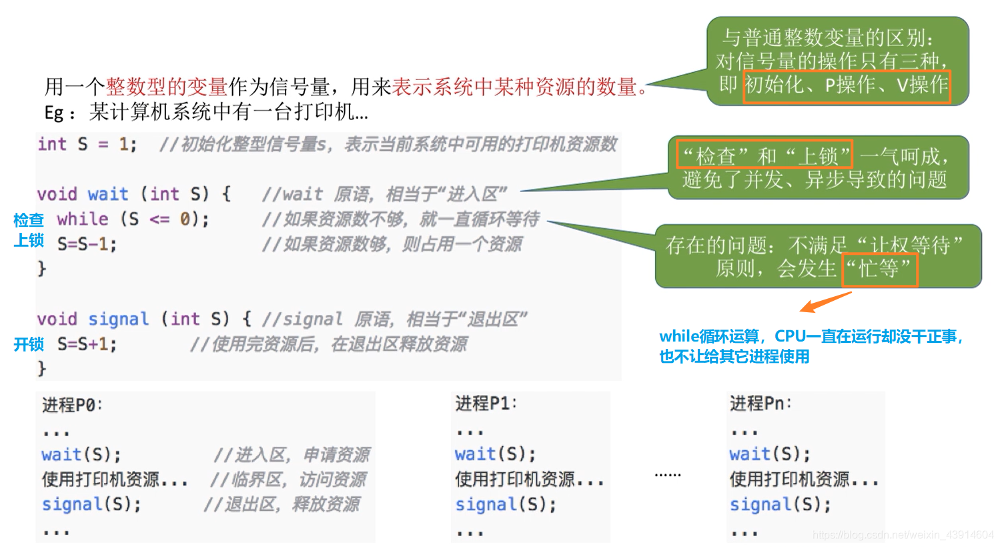

#### 4.记录型信号

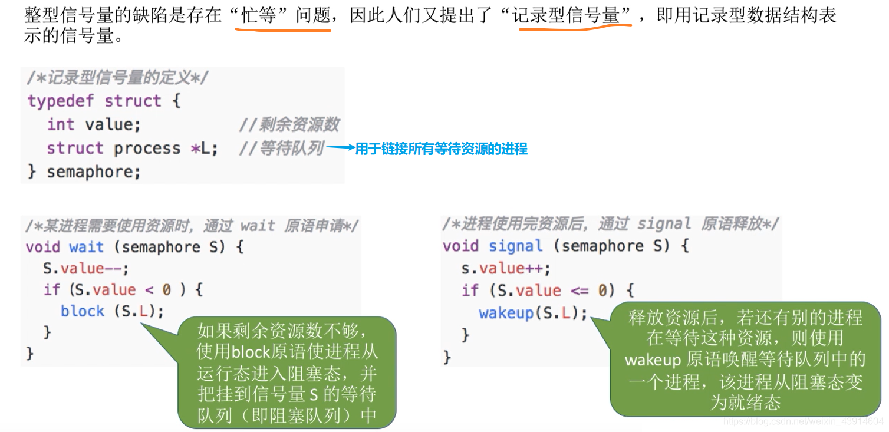

##### （1）举一个生动形象的例子了解记录型信号量

- 一张图咱们回忆一下进程的状态

  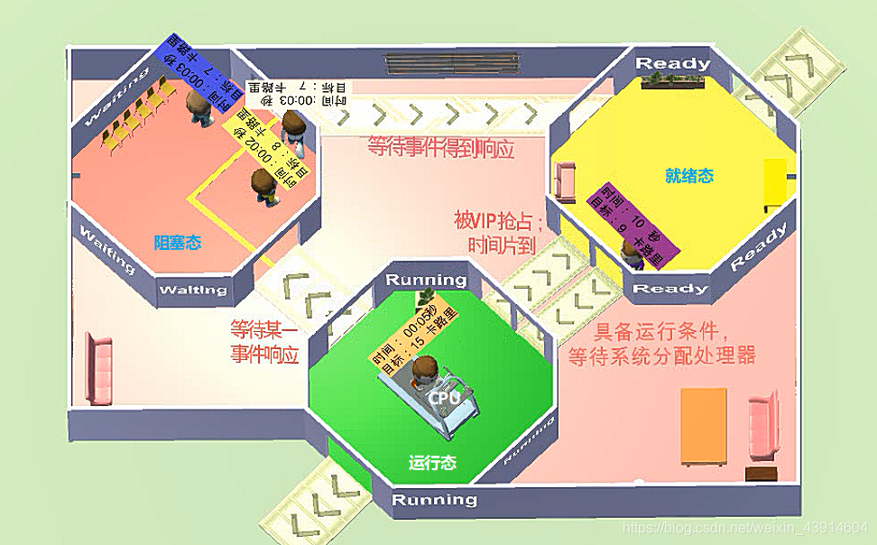

- 一个例子

  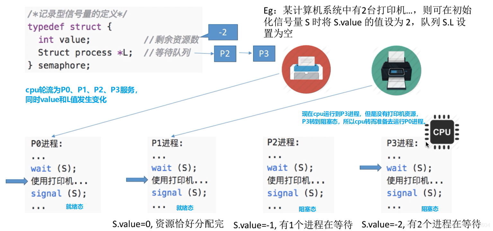

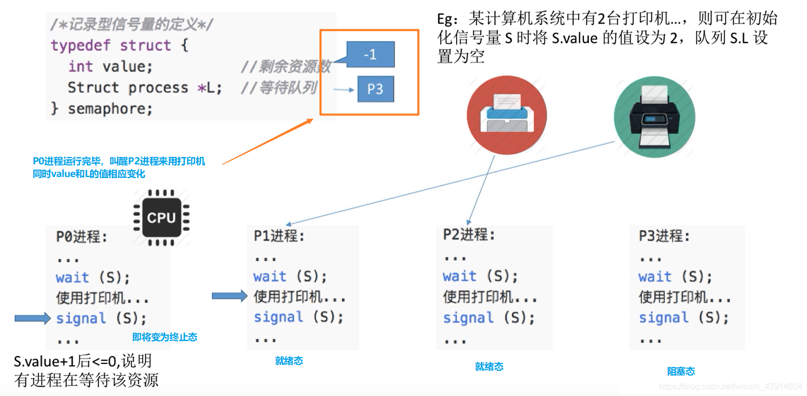

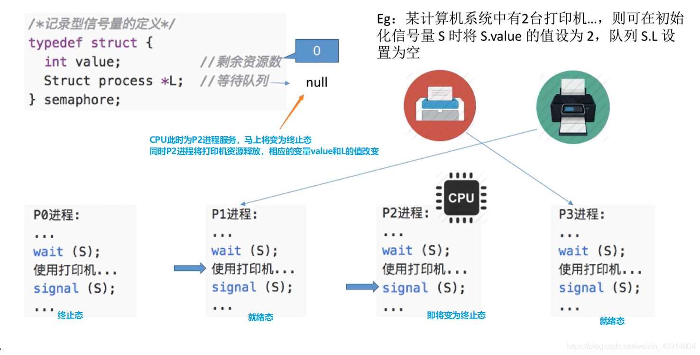

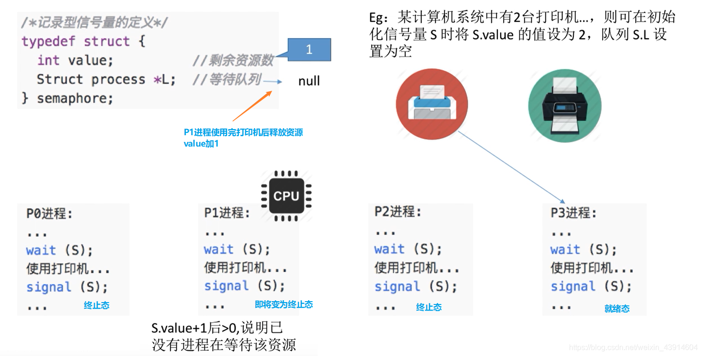

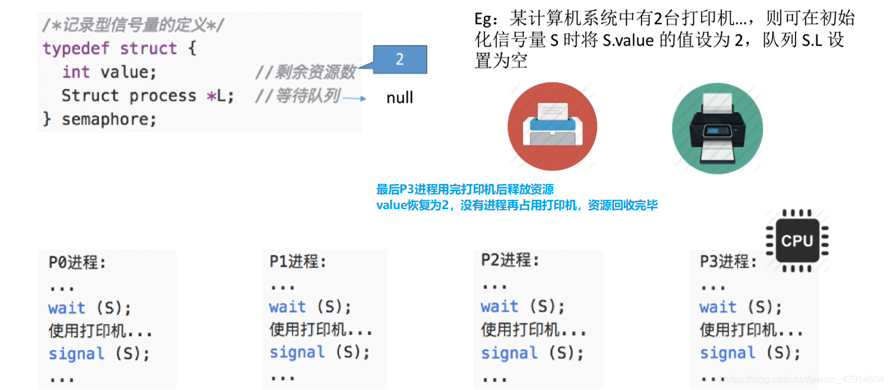

##### （2）梳理一下记录型信号量的知识点（P、V）

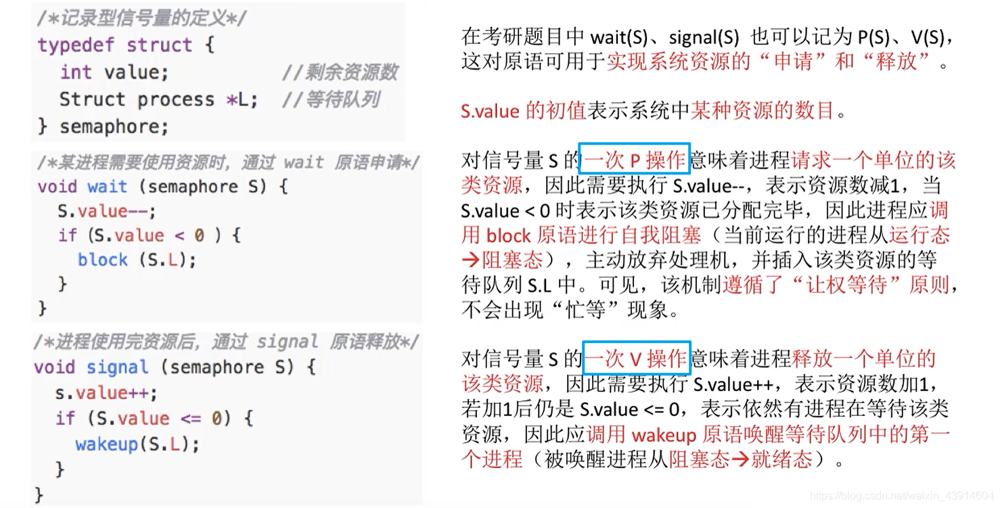