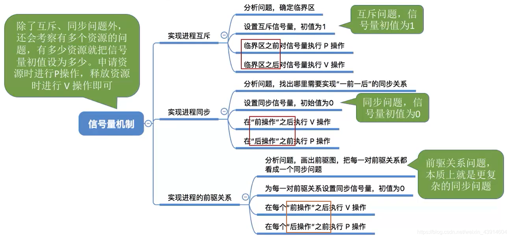
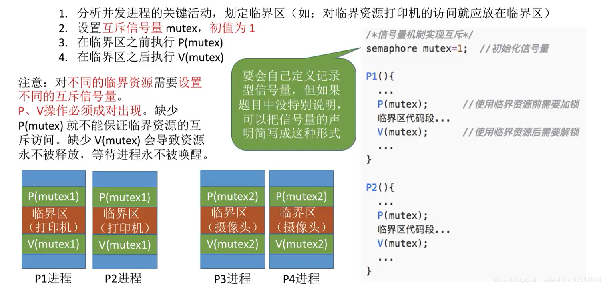
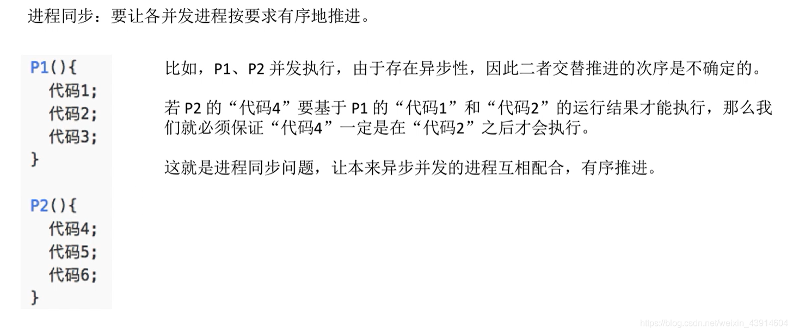
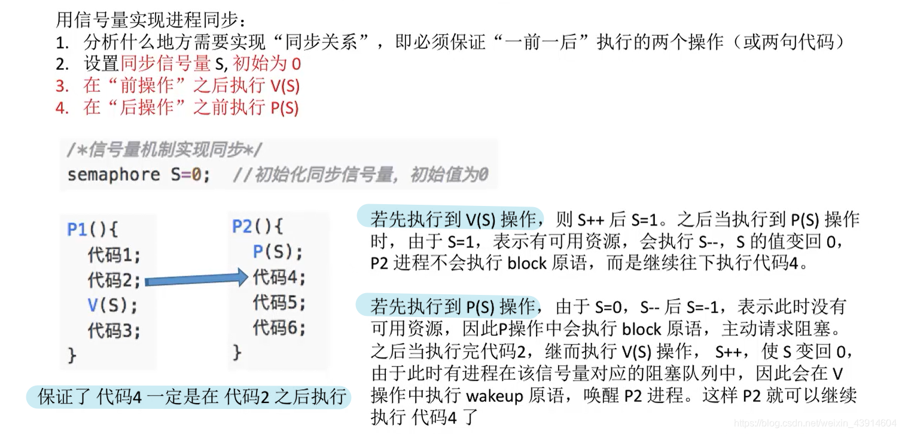
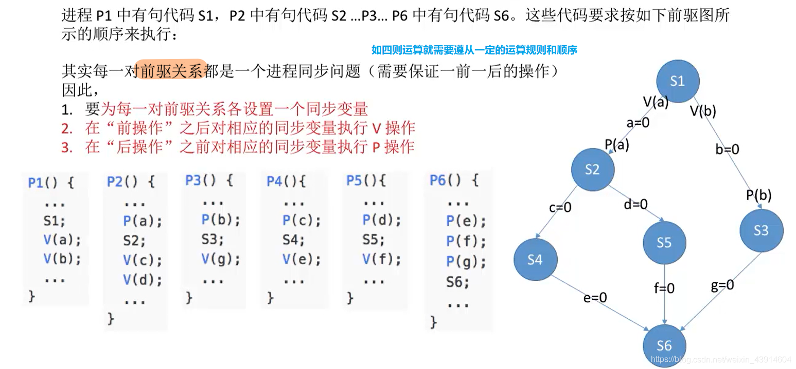

# 2.3.5 操作系统之信号量机制实现进程的互斥、同步与前驱关系

#### 0.思维导图

#### 1.[信号量](https://so.csdn.net/so/search?q=信号量&spm=1001.2101.3001.7020)机制实现进程互斥

#### 2.信号量机制实现进程同步

- 想象一下四则运算的顺序，加减乘除；

  

- 要想理解这一部分知识，必须知道P、V操作的内部实现原理

  

#### 3.信号量机制实现前驱关系

