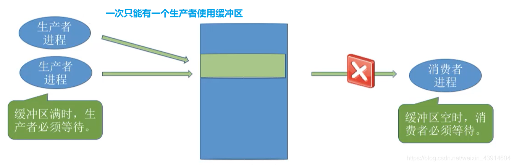

# 2.3.6 操作系统之进程同步与互斥经典问题（生产者-消费者问题、多生产者-多消费者问题、吸烟者问题、读者-写者问题、哲学家进餐问题）

#### 0.前言

- 同步时，前V后P

  

#### 1.生产者-消费者问题

##### （1）问题描述

- 系统中有`一组生产者进程`和`一组消费者进程`，生产者进程每次`生产一个`产品放入缓冲区，消费者进程每次从缓冲区中`取出一个`产品并使用。(注: 这里的“产品”理解为某种数据)
- 生产者、消费者`共享`一个初始为空、大小为n的`缓冲区`。
- 只有缓冲区`没满`时，`生产者`才能把产品`放入`缓冲区，否则必须等待
- 只有缓冲区`不空`时，`消费者`才能从中`取出`产品，否则必须等待。
- 缓冲区是临界资源，各进程必须`互斥`地访问。

##### （2）问题分析

- 1)关系分析。生产者和消费者对缓冲区互斥访问是`互斥关系`，同时生产者和消费者又是一个相互协作的关系，只有生产者生产之后,消费者才能消费，它们也是`同步关系`。

- 2)整理思路。根据各进程的操作流程确定P、V操作的大致顺序。
  生产者每次要消耗(P）一个空闲缓冲区，并生产(V)一个产品。
  消费者每次要消耗(P）一个产品，并释放一个空闲缓冲区(V)。
  往缓冲区放入/取走产品需要互斥。

- 3)信号量设置。设置信号量。设置需要的信号量，并根据题目条件确定信号量初值。( 互斥信号量初值一般为1，同步信号量的初始值要看对应资源的初始值是多少)

  

##### （3）如何实现？

##### （4）实现互斥的P操作一定要在实现同步的P操作之后

##### （5）知识回顾与重要考点

#### 2.多生产者-多消费者问题

##### （1）问题描述

##### （2）问题分析

##### （3）实现方法

###### ① 有mutex

###### ② 无mutex

###### ③ 为什么有mutex和没有mutex一样呢？

- 原因在于:本题中的缓冲区大小为1，在任何时刻，apple、 orange、 plate 三个同步信号量中最多只有一个是1。因此在任何时刻，最多只有一个进程的P操作不会被阻塞，并顺利地进入临界区…

###### ④ 如果有两个盘子plate

##### （4）知识总结与重要考点

#### 3.读者-写者问题

#### （1）问题描述

#### （2）问题分析

#### （3）实现方法

###### ① 给count加mutex互斥访问

- 这里说一下为什么要加mutex。
- 比如：当count=0时，第一个读者进程执行到p(rw),rw=0,假设此时时间片到了，切换到第二个读者进程,第二个进程发现count=0,则执行p(rw)，但是此时rw=0，于是第二个进程被堵在p（rw）这里，同理，后面的可能会有多个进程堵在p(rw)，只有当第一个进程再次获得时间片，执行count++,让count不为0，然后其他进程就可以直接绕过if直接进行count++来访问文件，但是第三个读者进程和后面的几个可能堵在p(rw)的多个读者进程则必须得等count–为0后才可以再次和写进程竞争来访问文件，对count的访问没有做到一气呵成，会导致本来一些进程一直堵在p（rw）。

###### ② 加一个w实现“读写公平法”

- 在上面的算法中，读进程是优先的，即当存在读进程时，写操作将被延迟，且只要有 一个读进程活跃，随后而来的读进程都将被允许访问文件。这样的方式会导致写进程可能长时间等待，且存在写进程`“饿死”`的情况。
- 若希望写进程优先，`即当有读进程正在读共享文件时，有写进程请求访问，这时应禁止后续读进程的请求，等到已在共享文件的读进程执行完毕，立即让写进程执行，只有在无写进程执行的情况下才允许读进程再次运行`。为此，增加一个信号量并在上面程序的writer()和 reader()函数中各增加一对PV操作，就可以得到写进程优先的解决程序。

#### （4）知识回顾与重要考点

#### 4.吸烟者问题

##### （1）问题描述

##### （2）问题分析

##### （3）实现方法

##### （4）知识回顾与重要考点

#### 5.哲学家进餐问题

##### （1）问题描述

##### （2）问题分析

##### （3）如何实现

##### （4）知识回顾与重要考点

