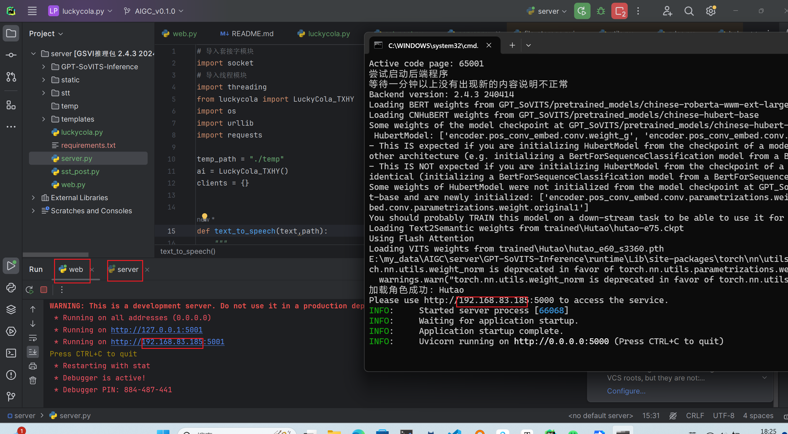
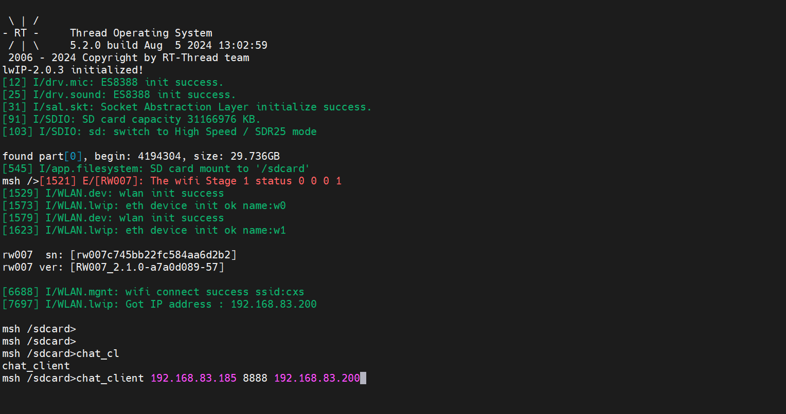
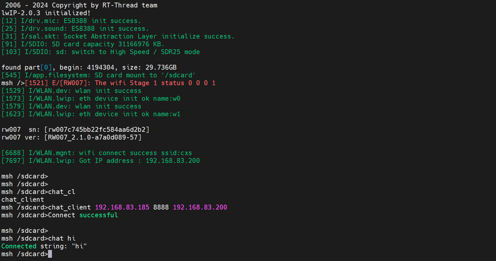
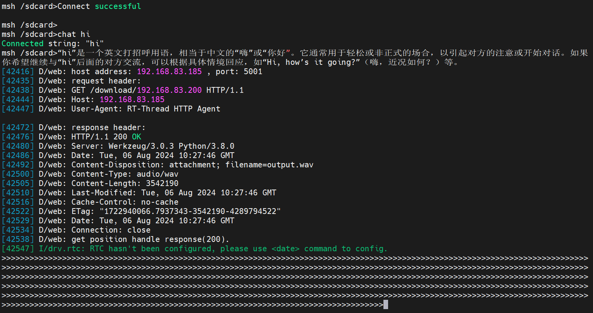
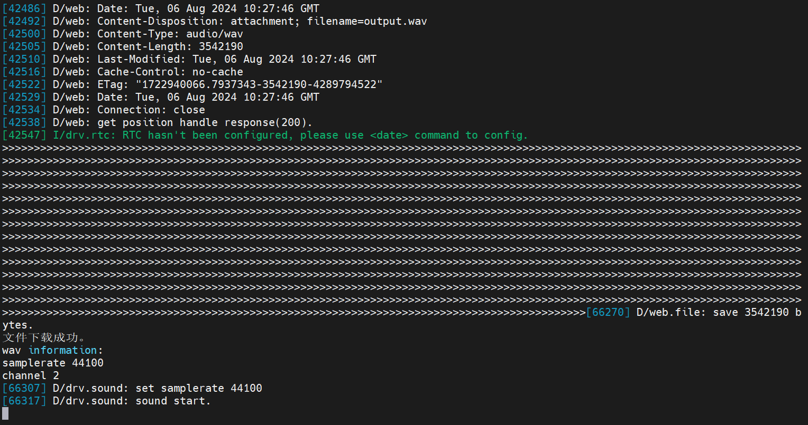

# AIGC


## 本项目基于以下项目：

* [RVC-Boss/GPT-SoVITS: 1 min voice data can also be used to train a good TTS model! (few shot voice cloning) (github.com)](https://github.com/RVC-Boss/GPT-SoVITS)

* [jianchang512/stt: Voice Recognition to Text Tool / 一个离线运行的本地语音识别转文字服务，输出json、srt字幕带时间戳、纯文字格式 (github.com)](https://github.com/jianchang512/stt)

* cjson

* webclient

* 星火一号bsp

* [LuckyCola](https://luckycola.com.cn/public/dist/#/)

  


## 部署方法

### server

#### luckycola.py

```pyt
import requests
import json
class LuckyCola_TXHY():
    """
    注册网址：https://luckycola.com.cn/public/dist/#/
    使用的为腾讯混元大模型的服务

    填写自己的appkey
    uid
    """
    url = 'https://luckycola.com.cn/hunyuan/txhy'
    appKey = "your appkey"
    uid = "your uid"
    headers = {"Content-Type": "application/json"}
    def __init__(self):

        pass

    @staticmethod
    def make_send_json(ques,isLongChat=0):
        """
        return : 默认不支持长对话
        """
        return {"appKey":LuckyCola_TXHY.appKey,"uid":LuckyCola_TXHY.uid,"ques":ques,"isLongChat":isLongChat}
    @staticmethod
    def get_assitant(data):
        if data["code"] !=0:
            return "状态码不对"

        return str(data["data"]["result"]["Content"])

    def post(self,user_ed):
        json_payload = json.dumps(user_ed)
        response = requests.post(LuckyCola_TXHY.url,data=json_payload,headers=LuckyCola_TXHY.headers)
        return LuckyCola_TXHY.get_assitant(response.json())


if __name__ == '__main__':
    ai = LuckyCola_TXHY()
    while 1:
        ques = input("请输入你的问题:\t")
        isLongChat = int(input("是否长对话:\t"))

        user_ed = LuckyCola_TXHY.make_send_json(ques,isLongChat)

        assitant = ai.post(user_ed)
        print(assitant)
```


* 此文件提供了luckycola 中腾讯混元大模型的api接口方式 
  * 并且提供三个接口
    * make_send_json()
      * 制作要发送的json数据包，返回类型为dict
    * post()
      * 发送json数据包
      * reture 经过get_assitant解析过的数据
    * get_assitant()
       *  解析返回json中的assitant


* 发送与解析
  * [腾讯AI混元大模型API | LuckyCola](https://luckycola.com.cn/public/docs/shares/api/hunyuan.html)


#### web.py

```python
# coding:utf-8

from flask import Flask, render_template, request, redirect, url_for
from flask import send_from_directory
from werkzeug.utils import secure_filename
import os

app = Flask(__name__)
base_path = "./temp/"
@app.route('/upload/<filename>', methods=['POST', 'GET'])
def upload(filename):
    full_path = os.path.join(base_path, filename)
    if request.method == 'POST':
        f = request.files['file']
        basepath = os.path.dirname(__file__)
        upload_path = os.path.join(basepath, full_path, secure_filename("input.wav"))
        try:
            f.save(upload_path)
            print('uploading ...')
        except Exception as e:
            # 处理文件保存过程中的异常
            print(e)
    return render_template('upload.html')

@app.route('/download/<filename>',methods=['GET'])
def download(filename):
    # 注意这里直接使用了传入的 filename，假设前端传入的 filename 已经包含了完整的路径信息
    full_path = os.path.join(base_path, filename)
    print('downloading ...')
    return send_from_directory(full_path,"output.wav",as_attachment=True)

if __name__ == '__main__':
    app.run(host="0.0.0.0",port=5001, debug=True)
```


* 本脚本，意义在于创建一个web服务器，提供文件上传与下载，所上传的文件会根据板子的ip来在本地temp文件夹下面进行存放output.wav 与 input.wav。
* v0.1.0仅仅使用了download。作为板子下载处理好的文字转语音的音频文件

  * upload，留作以后音频交互使用

*** 注意***：此处使用5001端口，因为文字转语音需要使用5000端口。

#### server

```python
# 导入套接字模块
import socket
# 导入线程模块
import threading
from luckycola import LuckyCola_TXHY
import os
import urllib
import requests

temp_path = "./temp"
ai = LuckyCola_TXHY() #借助此行代码，可以进行自己编写自己的gpt对话
clients = {}


def text_to_speech(text,path):
    """
    :param text:文本（str）
    :param path:指定报错的文件路径
    :return: 直接播放传入的str文本内容
    """
    url = urllib.parse.quote(text)

    wav = requests.get(
        f'http://127.0.0.1:5000/tts?character=胡桃&text={url}')

    wav = wav.content
    with open(path, 'wb') as fp:
        fp.write(wav)
    new_path = os.path.join(temp_path,tcp_client_address[0],"output.wav")
    os.system(f"ffmpeg -i {path} -y -ar 44100 -ac 2 {new_path}")
    # re = AudioSegment.from_wav('temp.wav')
    # play(re)

    return new_path


# 定义个函数,使其专门重复处理客户的请求数据（也就是重复接受一个用户的消息并且重复回答，直到用户选择下线）
def dispose_client_request(tcp_client_1, tcp_client_address):
    # 5 循环接收和发送数据
    while True:
        recv_data = tcp_client_1.recv(4096)

        # 6 有消息就回复数据，消息长度为0就是说明客户端下线了
        if recv_data:
            print("客户端是:", tcp_client_address)
            print("客户端发来的消息是:", recv_data.decode())
            user = recv_data.decode()
            #通过make_send_json() 进行制作要发送的json数据包 返回数据类型为dict
            user_ed = ai.make_send_json(user,1)
            #将制作好的json数据包 进行发送并接受返回数据 str :assitant
            assitant = ai.post(user_ed)

            text_to_speech(assitant,clients[tcp_client_address[0]]["temp"])


            send_data = assitant.encode()
            tcp_client_1.send(send_data)

        else:
            print("%s 客户端下线了..." % tcp_client_address[1])
            tcp_client_1.close()
            break


if __name__ == '__main__':

    # 1 创建服务端套接字对象
    tcp_server = socket.socket(socket.AF_INET, socket.SOCK_STREAM)

    # 设置端口复用，使程序退出后端口马上释放
    tcp_server.setsockopt(socket.SOL_SOCKET, socket.SO_REUSEADDR, True)

    # 2 绑定端口
    tcp_server.bind(("0.0.0.0",8888))

    # 3 设置监听
    tcp_server.listen(128)

    # 4 循环等待客户端连接请求（也就是最多可以同时有128个用户连接到服务器进行通信）
    while True:
        tcp_client_1, tcp_client_address = tcp_server.accept()

        if tcp_client_address[0] not in clients.keys():
            clients[tcp_client_address[0]] = {}
            clients[tcp_client_address[0]]["port"] = 69
            if os.path.exists(os.path.join(temp_path, f"{tcp_client_address[0]}")):
                pass
            else:
                os.mkdir(os.path.join(temp_path, f"{tcp_client_address[0]}"))
            clients[tcp_client_address[0]]["temp"] = os.path.join(temp_path, f"{tcp_client_address[0]}",
                                                                       "temp.wav")


        # 创建多线程对象
        thd = threading.Thread(target=dispose_client_request, args=(tcp_client_1, tcp_client_address))

        # 设置守护主线程  即如果主线程结束了 那子线程中也都销毁了  防止主线程无法退出
        thd.setDaemon(True)

        # 启动子线程对象
        thd.start()

    # 7 关闭服务器套接字 （其实可以不用关闭，因为服务器一直都需要运行）
    # tcp_server.close()

```

* 进行建立tcp服务端，此时需要注意自己的ip地址以及端口号，默认端口号为 8888

* ai = LuckyCola_TXHY() #借助此行代码，可以进行自己编写自己的gpt对话


#### 关于启动本地语音转文字服务

***具体参考以下链接***

* 将训练好的音频模型放入 VGPT-SoVITS-v2-240807文件夹下面的trained文件夹下面
* 将config里面的model_name修改为自己需要的模型名称
* 启动config

```python
import os
import json

model_path = "./GPT-SoVITS-v2-240807/trained/"
model_name = "test" #修改此处可以选择模型

def scan():
    """
    对其模型文件夹进行扫描,所拥有的模型
    """
    trained = {}
    for i in os.listdir(model_path):
        trained[i]={}
        for j in os.listdir(os.path.join(model_path,i)):
            if j.endswith(".json"):
                trained[i]["json"] = os.path.abspath(os.path.join(model_path,i,j))
            elif j.endswith(".pth"):
                trained[i]["pth"] = os.path.abspath(os.path.join(model_path,i,j))
            elif j.endswith("ckpt"):
                trained[i]["ckpt"] = os.path.abspath(os.path.join(model_path,i,j))
            elif j.endswith(".wav"):
                trained[i]["wav"] = os.path.abspath(os.path.join(model_path,i,j))
                trained[i]["str"] = j.split(".wav")[0]
    return trained


if __name__ == "__main__":

    trained = scan()
    config_qijingchun = trained.get(model_name)
    for i,j in trained.items():
        print(i,"\n",j)
        print("*"*100)
    if config_qijingchun:
        os.chdir("./GPT-SoVITS-v2-240807")
        wav = config_qijingchun.get("wav")
        strs = config_qijingchun.get("str")
        port =5000
        ip = "0.0.0.0"
        ckpt = config_qijingchun.get("ckpt")
        pt = config_qijingchun.get("pth")
        text = f".\\runtime\\python.exe .\\api.py -dr {wav} -dt {strs} -a {ip} -p {port} -s {pt} -g {ckpt} -dl zh"
        os.system(text)
```


#### 关于语音转文字

具体参考以下链接

* [jianchang512/stt: Voice Recognition to Text Tool / 一个离线运行的本地语音识别转文字服务，输出json、srt字幕带时间戳、纯文字格式 (github.com)](https://github.com/jianchang512/stt)

#### 参考server - sst_post.py

```pyt
import requests
class SpeehToText(object):
    url = "http://127.0.0.1:9977/api"

    def __init__(self):
        self.data = None

        self.make_data()
        pass

    def make_data(self,response_format="text"):

        """
        设置回复信息
        json|str|text
        """
        self.data = {"language":"zh","model":'large-v3',"response_format":response_format}

    def post(self,file):
        """

        :param file:二进制上传
        """

        response = requests.post(SpeehToText.url,data=self.data,files={"file":file})
        return response.json()
if __name__ == '__main__':
    api = SpeehToText()
    file = open("./陈乐一 - 星之火～awake～.flac","rb")
    data = api.post(file)
    print(data)

```


### client

#### 

#### 下载env2.0

* [rt-thread.org/download.html#download-rt-thread-env-tool](https://www.rt-thread.org/download.html#download-rt-thread-env-tool)
* 下载OpenOCD

  * 下载stlink


	## env + vscode配置环境

* 参考[星火1号+VSCode+Env环境搭建 (qq.com)](https://docs.qq.com/doc/DY294dGJ0WldNVkxQ)


## 烧录后使用教程

## server 目录下

***安装conda***： [Anaconda超详细安装教程（Windows环境下）_conda安装-CSDN博客](https://blog.csdn.net/fan18317517352/article/details/123035625)


```python
conda create -n server python=3.8.0
conda activate server
```


```python
pip install -r requirements.txt -i https://pypi.tuna.tsinghua.edu.cn/simple
pip install pytorch -i https://pypi.tuna.tsinghua.edu.cn/simple

```

***关于安装gpu支持torch***：[PyTorch安装、配置环境（全网最新最全）-CSDN博客](https://blog.csdn.net/weixin_46334272/article/details/135307663)

* 创建两个会话
* python server.py
* python web.py
* 启动本地文字转语音服务





## 客户端使用：









* chat_client <目标IP>  <目标端口，默认输入8888>	<自身IP>
  * 连接成功会有connect successful
* chat <输入问题>
  * 等待回复以及音频文件的下载


## 关于自定义gpt回复模型

### 创建<my_gpt.py>

```python
import your_need
class your_gpt():
	
    def __init__(self):

        pass

    @staticmethod
    def make_send_json(ques):
        """
        return: 你需要传入的json数据
        """
		pass
    @staticmethod
    def get_assitant(data):
        """
        return : 解析返回的assitant 数据
        """
	`	pass

    def post(self,user_ed):
        """
        return : 返回最后的assitant:str 文本回复内容
        """
  		pass


if __name__ == '__main__':
    ai = LuckyCola_TXHY()
    while 1:
        ques = input("请输入你的问题:\t")

        user_ed = LuckyCola_TXHY.make_send_json(ques)

        assitant = ai.post(user_ed)
        print(assitant)

```

### 更改server.py

```python
# 导入套接字模块
import socket
# 导入线程模块
import threading
from my_gpy import your_gpt # 导入你修改后自定义的gpt					*******注意
import os
import urllib
import requests

temp_path = "./temp"
ai = your_gpt()														********注意
clients = {}


def text_to_speech(text,path):
    """
    :param text:文本（str）
    :param path:指定报错的文件路径
    :return: 直接播放传入的str文本内容
    """
    url = urllib.parse.quote(text)

    wav = requests.get(
        f'http://127.0.0.1:5000?text={url}&text_language=zh')

    wav = wav.content
    with open(path, 'wb') as fp:
        fp.write(wav)
    new_path = os.path.join(temp_path,tcp_client_address[0],"output.wav")
    os.system(f"ffmpeg -i {path} -y -ar 44100 -ac 2 {new_path}")
    # re = AudioSegment.from_wav('temp.wav')
    # play(re)

    return new_path


# 定义个函数,使其专门重复处理客户的请求数据（也就是重复接受一个用户的消息并且重复回答，直到用户选择下线）
def dispose_client_request(tcp_client_1, tcp_client_address):
    # 5 循环接收和发送数据
    while True:
        recv_data = tcp_client_1.recv(4096)

        # 6 有消息就回复数据，消息长度为0就是说明客户端下线了
        if recv_data:
            print("客户端是:", tcp_client_address)
            print("客户端发来的消息是:", recv_data.decode())
            user = recv_data.decode()
            user_ed = ai.make_send_json(user,1)
            assitant = ai.post(user_ed)

            text_to_speech(assitant,clients[tcp_client_address[0]]["temp"])


            send_data = assitant.encode()
            tcp_client_1.send(send_data)

        else:
            print("%s 客户端下线了..." % tcp_client_address[1])
            tcp_client_1.close()
            break


if __name__ == '__main__':

    # 1 创建服务端套接字对象
    tcp_server = socket.socket(socket.AF_INET, socket.SOCK_STREAM)

    # 设置端口复用，使程序退出后端口马上释放
    tcp_server.setsockopt(socket.SOL_SOCKET, socket.SO_REUSEADDR, True)

    # 2 绑定端口
    tcp_server.bind(("0.0.0.0",8888))

    # 3 设置监听
    tcp_server.listen(128)

    # 4 循环等待客户端连接请求（也就是最多可以同时有128个用户连接到服务器进行通信）
    while True:
        tcp_client_1, tcp_client_address = tcp_server.accept()

        if tcp_client_address[0] not in clients.keys():
            clients[tcp_client_address[0]] = {}
            clients[tcp_client_address[0]]["port"] = 69
            if os.path.exists(os.path.join(temp_path, f"{tcp_client_address[0]}")):
                pass
            else:
                os.mkdir(os.path.join(temp_path, f"{tcp_client_address[0]}"))
            clients[tcp_client_address[0]]["temp"] = os.path.join(temp_path, f"{tcp_client_address[0]}",
                                                                       "temp.wav")


        # 创建多线程对象
        thd = threading.Thread(target=dispose_client_request, args=(tcp_client_1, tcp_client_address))

        # 设置守护主线程  即如果主线程结束了 那子线程中也都销毁了  防止主线程无法退出
        thd.setDaemon(True)

        # 启动子线程对象
        thd.start()

    # 7 关闭服务器套接字 （其实可以不用关闭，因为服务器一直都需要运行）
    # tcp_server.close()

```


* from my_gpy import your_gpt # 导入你修改后自定义的gpt
* ai = your_gpt()

修改上述


## 关于自定义文字转语音模型


* [RT-Thread 夏令营：AIGC 自定义训练音频模型以及导入 06_哔哩哔哩_bilibili](https://www.bilibili.com/video/BV1TJeEekETo/?vd_source=e1ed59d2289fbb8b9d8a094b657fd130)


## 附加百度网盘文件

里面包括了训练环境，压缩包大小18g左右 不需要进行额外下载模型文件


通过百度网盘分享的文件：AIGC.7z
链接：https://pan.baidu.com/s/155qI1O1gWFjWndYCY2lznA?pwd=31xa 
提取码：31xa 
--来自百度网盘超级会员V2的分享

## 项目解说视频

通过百度网盘分享的文件：项目解说视频.7z
链接：https://pan.baidu.com/s/1jw5U0rncqRo1DRc2epkxww?pwd=aecq 
提取码：aecq 
--来自百度网盘超级会员V1的分享


# 具体项目链接

[CXSforHPU/rt_demo at AIGC_V0.1.0 (github.com)](https://github.com/CXSforHPU/rt_demo/tree/AIGC_V0.1.0)

