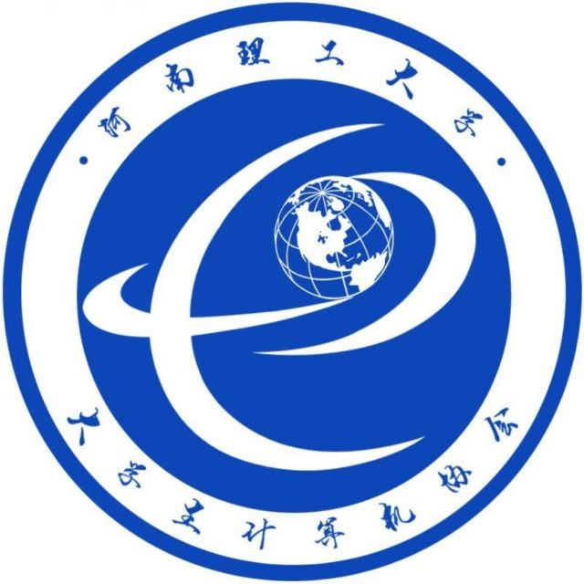

# 社团简介

大学生计算机协会成立于2009年5月，集聚了广大热爱计算机，热爱服务的同学,现为我校优秀的综合性计算机社团。

协会本着服务广大在校师生的宗旨，积极开展义务维修等志愿活动，培养学生学习计算机相关知识的兴趣，协会成员利用自身的的专业知识，服务同学、提升自我，积极参与各级各类的比赛、活动。协会以“分享、创新、团结”为宗旨，具备完善的内部组织、拥有信息安全部、硬件部、编程部等特色部门，各具特色的内部培训、出色的社团精品活动、紧密的外界合作、专注的人才培养。同时，协会坚持学习与实践相结合，利用内部各部门的特色优势，积极服务、帮助广大热爱计算机的同学，同时协会积极发挥相关的专业知识，积极开展相关的内部培训、举办各级各类竞赛活动、开展义务维修等志愿活动，旨在提升自己，服务同学。

# PR 提交教程

[PR教程](./PR提交教程/readme.md)